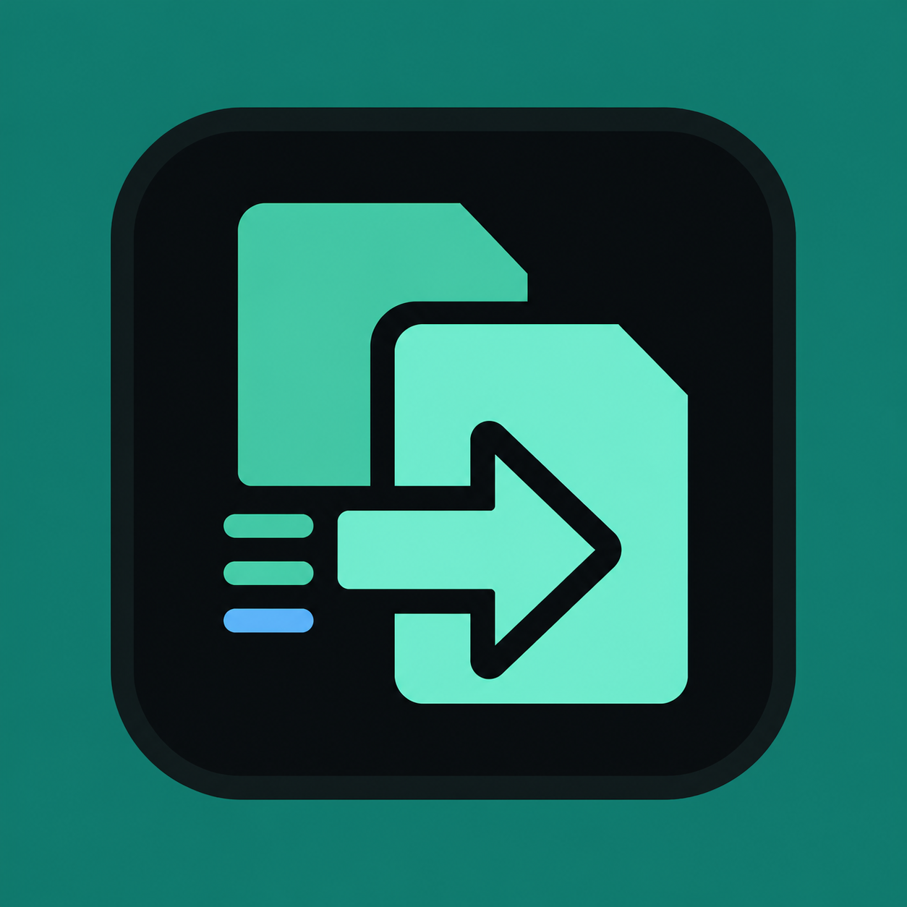

# RobustCopy

<p align="center">
  
</p>

A native Windows interface for `robocopy.exe`, built with .NET 10 WPF. It keeps Robocopy's reliability while adding safe option selection, descriptive help, pre-scan totals, live progress, Pause/Resume/Stop controls, command preview, and persistent logs.

The interface design references are kept in [`docs/mockups`](docs/mockups/README.md).

## Download

The current release is **RobustCopy 1.0.1**, published by **Kaleb Creative Studio** for Windows 10 and Windows 11 x64.

- [Download RobustCopy.exe](https://github.com/tnoahc/RobustCopy/releases/download/v1.0.1/RobustCopy.exe)
- [View the GitHub release](https://github.com/tnoahc/RobustCopy/releases/tag/v1.0.1)
- [Browse the GitHub repository](https://github.com/tnoahc/RobustCopy)

The 62.1 MB executable is self-contained; no separate .NET installation is required. Its SHA-256 checksum is:

```text
2EDDA6466782A6576782ABA3ACB70147188FF5094CCF4D91795AC526427F208B  RobustCopy.exe
```

## Features

- Choose local, mapped-drive, and UNC source/destination folders through the Windows folder picker.
- Swap source and destination in one click.
- Select Robocopy switches from categorized, two-column strategy cards with descriptions and automatic conflict handling.
- Enter additional supported switches in the Advanced field.
- Preview the exact command while configuring a job.
- Pre-scan safely with `/L` for planned files, bytes, and destination deletions.
- Show overall/current-file progress, transfer speed, ETA, file counts, and live output.
- Pause and resume the live Robocopy process, or stop it permanently.
- Require confirmation for Mirror, Purge, and Move modes.
- Save UTF-8 run transcripts under `%LocalAppData%\RobustCopy\Logs`.
- Preserve logs from earlier installations by copying them into the RobustCopy log directory on first use.
- Run Robocopy without `cmd.exe`; paths and switches are passed through `ProcessStartInfo.ArgumentList`.

Robocopy console output is decoded using the active Windows OEM code page and then written as UTF-8. The GUI reserves `/UNICODE` because the installed Robocopy build emits a mixed BOM/console stream for that switch when stdout is redirected, which cannot be parsed reliably for live progress.

## Interface

The application uses a dark console-inspired three-panel layout:

- **Transfer locations** contains the source, destination, file pattern, and command preview.
- **Transfer strategy** provides scrollable option cards using the original Folders, Reliability, Metadata, Filters, Performance, and Destructive Operations groups.
- **Live transfer overview** shows progress, current-file details, transfer metrics, and the saved run transcript.

The Start, Pause, Resume, and Stop controls remain visible in the header, alongside safety guidance and the current run state. The interactive HTML source and rendered visual reference are documented in [`docs/mockups`](docs/mockups/README.md).

## Requirements

- Windows 10 or Windows 11, x64.
- The .NET 10 SDK is required only to build from source.
- The published self-contained executable does not require a separately installed .NET runtime.

## Build and run

Open PowerShell in this repository:

```powershell
dotnet build RobustCopy.slnx --configuration Release
dotnet run --project src\RobustCopy\RobustCopy.csproj
```

If an installer has just added the SDK and the current terminal has not refreshed its `PATH`, start a new PowerShell window or invoke `C:\Program Files\dotnet\dotnet.exe` directly.

## Tests

The repository uses a dependency-free executable test project so it can be verified without downloading a test framework. It covers command construction, validation, parsing, exit codes, and safe Robocopy integration in temporary folders, including Pause/Resume and Stop/Restart.

```powershell
dotnet run --project tests\RobustCopy.Tests\RobustCopy.Tests.csproj --configuration Release
```

## Publish a portable executable

```powershell
dotnet publish src\RobustCopy\RobustCopy.csproj `
  --configuration Release `
  --runtime win-x64 `
  --self-contained true `
  --output artifacts\publish
```

The main deliverable is `artifacts\publish\RobustCopy.exe`.

The `artifacts/` directory contains generated build outputs and visual verification files and is intentionally excluded from version control. Run the publish command whenever the distributable executable needs to be refreshed.

## Safety notes

- `/MIR` and `/PURGE` may delete destination content.
- `/MOV` and `/MOVE` delete successfully copied source content.
- The GUI performs a list-only pre-scan and shows a mandatory confirmation before these operations.
- Source and destination cannot be the same folder or contain one another.
- Backup modes may require Windows privileges that the current account does not have; the app does not auto-elevate.
- Stop terminates the current Robocopy process. Restartable mode (`/Z`) is enabled by default, so a later run can continue supported partial transfers.
